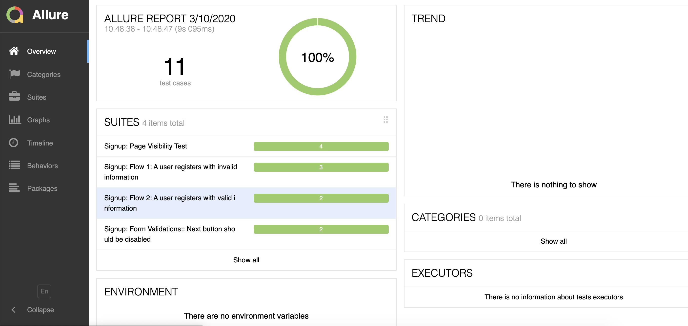

# WebdriverIO e2e tests

## Why WebdriverIO:
WebdriverIO is a custom implementation for selenium's W3C webdriver API. It is written in Javascript and packaged into 'npm' and runs on Node.js.

**Main Features of WebdriverIO:**
- It has simple and easy Syntax.
- It has 1st class support for the WebDriver specification as well as to Appium and allows to run tests on browser, desktop and mobile.
- It has integrated test runner which helps us to write asynchronous commands in a synchronous way so that we don’t need to care about how to handle a Promise to avoid racing conditions.
- It has 'wdio setup wizard' which makes our project setup very easy.
- Custom functions, we can write our own javascript functions.
- The test runner also comes with a variety of hooks that allow us to interfere into the test process in order to e.g. take screenshots if an error occurs or modify the test procedure according to a previous test result.
- It can be integrated with browserstack, Applitools, Appium, SauceLab, Docker and many other popular tools. More on tools and services can be found [here](https://webdriver.io/docs/gettingstarted.html)

## Getting Started
To get this project up and running please follow the below steps:

- Install NodeJS v8.11.2 or higher on your local machine
- Clone this project
- Run "npm install" in any terminal to install necessary packages and libraries
- Run "npm run test"

### Jasmine JavaScript framework
The tests are written in Jasmine framework. More about Jasmine can be found at https://jasmine.github.io/
Tests are placed in `*.specs.js` files in the `/test/specs/` directory.

## Reporters
WebdriverIO uses several different types of test reporters to show test results (pass/failure). This project is using 'Spec' and 'Allure' for reporting.

**Spec**
Test reporter, that prints detailed results to console.

**Allure**
The Allure Reporter creates Allure test reports which is an HTML generated website with all necessary information to debug your test results and take a look on error screenshots.

To generate and view an allure report locally, run `npm run allure-report`. A typical Allure report will look like this

## The Page Object Design Pattern
This project is using page object design pattern to avoid duplication of the locators and keep the code and locators more maintainable and clean.